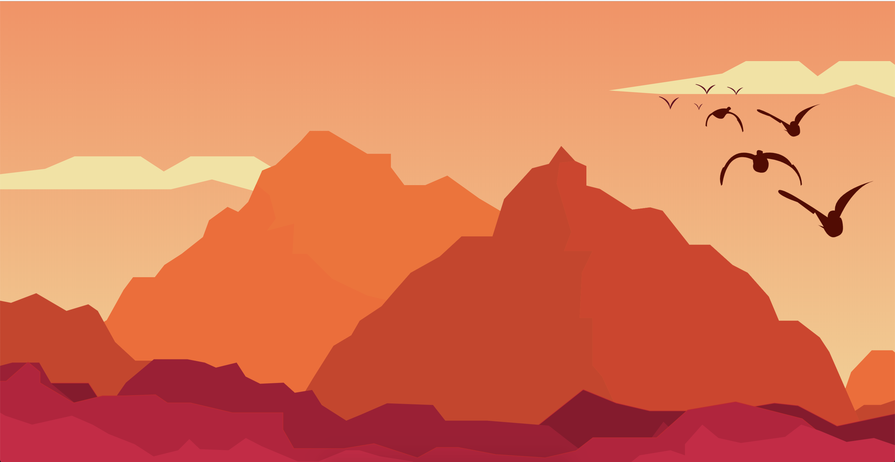

# Parallax with SVG Images

This was mainly so I could draw some pretty flat landscape art,
but I used a quick bit of JavaScript to apply a `transform()`
effect to multiple layers of an SVG scene in response to mouse
movement events. The result is a scene that looks 3d.

I tried adding a blur filter in CSS but it dropped the framerate
to well below the 60fps I wanted – maybe the next step should
be trying out some SVG filters.
